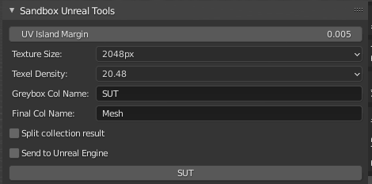

# Sandbox Unreal Tools (SUT)
UE: 5.5
Blender: 4.3

# Workflow / Idea
The idea is to have an easy way to do level design in Blender. First you do a rough greybox (before even thinking about modular assets). You aren't always in the lucky position where a modular kit is conveniant in the first step of level designing, and it's very annoying to do double work building some temporary modular assets and then clicking them together in Unreal (and restrictive).

The idea is that you should have a fast and seamless way to build levels (like good old Hammer / Source Engine stuff), and see fast results.

When you are done greyboxing you can then do the "double work" of actually making modular assets and placing them on top of your rough greybox. This should also make stuff less "boxy" and might show you where you need a few unique assets.

# Requirements
Depends on the following addons:

1. [Texel Density Checker 3 Github](https://github.com/mrven/Blender-Texel-Density-Checker) | https://gumroad.com/l/CEIOR
2. [Send To Unreal Github](https://github.com/poly-hammer/BlenderTools) Project got abandoned by epic. So use the newest fork from poly-hammer here.

The old not used stuff:
[OLD](https://github.com/EpicGames/BlenderTools) (You need to follow this: https://www.unrealengine.com/en-US/blog/download-our-new-blender-addons)

# Setup
1. Follow the "Send to Unreal" steps:
  * In unreal:
    - Pugins -> "Enable Python Editor Script Plugin"
    - Project Settings -> "Enable Remote Execution"
    - "Default Shape Complexity" and select "Use Complex Collision as Simple". (Probably default by now in unreal ?)
  * In Blender (Pipeline -> Export -> Seting Dialog): 
    - Set "Mesh Folder(Unreal)" to: /Game/Meshes/Dev (or anything you want)
    - Export -> FXB Export Settings -> Smoothing: Face
2. In Unreal drag the Meshes/Dev/SM_COLLECTION into your scene, and click the yellow little arrow in the transform panel, to reset it to 0,0,0 coordinates.
3. Put on some proper dev texture, you can use 1 color per grouped collection.

Done now you can:
Go into Blender -> Change something -> Press SUT -> Instant Changes in Unreal Engine

